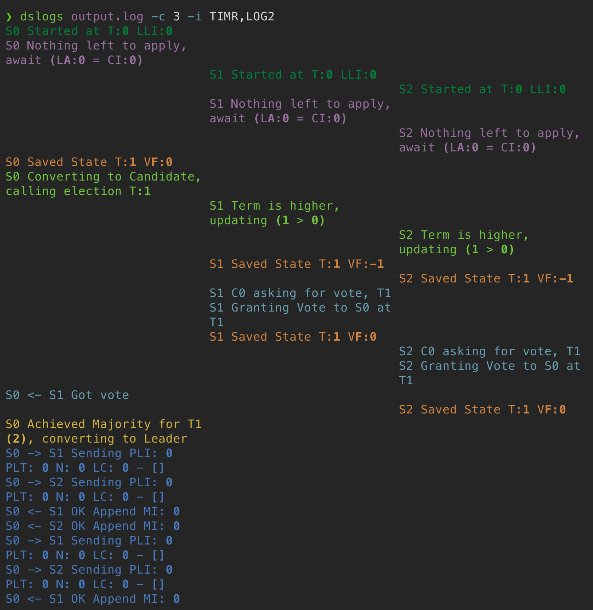

翻译的地址 https://blog.josejg.com/debugging-pretty/
# Debugging by Pretty Printing
本学期，我是麻省理工学院6.824分布式系统课程的教学助理
该课程要求学生迭代实现分布式共识协议Raft。
这是一项非常具有挑战性的任务，因为尽管Raft声称自己以“更容易理解Paxos”而闻名，但Raft是一个复杂的分布式系统，即使经过几次（或多次）尝试，也很难正确。当我上6.824时，我注意到完成实验室的瓶颈从来就不是为相应的实验室做大部分必要的实现。总的来说，我花的大部分时间是运行失败并解析日志，以了解系统是如何失败的，出了什么问题。

在这篇文章中，我不会讨论常见的错误或者Raft实现时通常是如何出错的，如果您对此感兴趣，请查看非常实用的Raft学生指南。我将介绍如何编写工具，让您调试分布式系统更加轻松。我们将了解如何从头开始构建这些基于终端的工具，最后使用调试套件，该套件将让您更有效地检测、理解和修复6.824实验室的错误。6.824中的所有实验室都以同样的方式调试，因此花一些时间来减少收集和解析日志可能是一个好主意。

## Debugging distributed code hits different
调试分布式系统是许多学生在接受6.824之前没有处理过的任务，它与其他形式的调试有根本不同。没有像gdb或pdb这样的易于访问的调试器可以让您逐步运行代码。传统的printf调试也有不足，因为可以有大量的例程并行运行（因此也可以打印）。在传统系统中，通过打印语句调试相当简单，因为通常只有一个执行线程，人们可以快速推理正在发生的事情。

对于像6.824实验室这样的分布式系统，有N台机器，每台机器都在同时执行几个线程。例如，在Raft验室，有N个peers并行执行，就好像他们在单独的机器中一样。对于每个peers，将有多个程序并行执行（通常是一个或两个计时器、一个应用器和一些RPC和RPC回复处理程序），导致大量的并发。虽然添加打印语句很容易，但解析它们可能相当棘手，特别是因为实验室的复杂性一周又一周地慢慢增加。话虽如此，浏览日志以识别逻辑中的错误是您降价时间的最佳选择。盯着你的代码或反复调整不同的部分在短期内可能会有所帮助，但bug需要更仔细的分析。

此外，在像Raft这样的系统中，不仅有多个线程同时打印输出，而且会打印异步的事件，例如：计时器重置、日志操作、选举、崩溃恢复或与复制状态机的通信。至关重要的是，不同类型的事件将以不同的频率发生，如果不以某种方式修剪，可能会导致日志过于冗长。

因此，我们最好知道谁在打印每行，以及消息与什么主题有关。我们的目标是设计一种可视化编码这些信息的方法。TL;DR：我们将使Go打印具有特定格式的无聊日志，然后利用丰富的Python库抽象出打印格式优美的终端输出。

## The Go Side
虽然大多数工具将使用Python脚本完成，但Go方面需要一些合作，以确保我们以易于解析的方式将信息提供给下游脚本。切换输出冗大。我实现的一个微小的生活质量改进是切换日志冗長性，而无需编辑go代码。稍后，这也将使我们的自动脚本运行程序更容易控制冗长性。由于6.824测试使用go测试，我们不能直接使用命令行参数。然而，我们可以使用的是环境变量。以下代码将访问VERBOSE环境变量，以确定是否需要详细日志。
```golang
// Retrieve the verbosity level from an environment variable
func getVerbosity() int {
	v := os.Getenv("VERBOSE")
	level := 0
	if v != "" {
		var err error
		level, err = strconv.Atoi(v)
		if err != nil {
			log.Fatalf("Invalid verbosity %v", v)
		}
	}
	return level
}
```
`记录topics`我决定从根本上改变我选择的printf函数，接受一个主题作为第一个参数，该主题编码消息属于哪个类别。第一个参数本质上是一个字符串，但为了使代码更容易重构（并且因为我不喜欢键入引号），我声明该主题为常量。这些主题与实现的不同部分有关，通过制作细粒度，我们将能够用不同的颜色过滤、搜索甚至突出显示它们。
```golang
type logTopic string
const (
	dClient  logTopic = "CLNT"
	dCommit  logTopic = "CMIT"
	dDrop    logTopic = "DROP"
	dError   logTopic = "ERRO"
	dInfo    logTopic = "INFO"
	dLeader  logTopic = "LEAD"
	dLog     logTopic = "LOG1"
	dLog2    logTopic = "LOG2"
	dPersist logTopic = "PERS"
	dSnap    logTopic = "SNAP"
	dTerm    logTopic = "TERM"
	dTest    logTopic = "TEST"
	dTimer   logTopic = "TIMR"
	dTrace   logTopic = "TRCE"
	dVote    logTopic = "VOTE"
	dWarn    logTopic = "WARN"
)
```
`打印功能` Go的最后一块移动件是我们将用于转储输出的实际打印功能。
我调用我的Debug，它打印带主题的消息和程序开始运行以来的毫秒数。
我禁用了所有日志记录的日期时间，因为该信息非常冗余（所有测试最多只能通过几分钟）。此外，在检查计时器相关事件是否以预期频率发生时，仅打印毫秒就非常有用。
```golang
var debugStart time.Time
var debugVerbosity int

func init() {
	debugVerbosity = getVerbosity()
	debugStart = time.Now()

	log.SetFlags(log.Flags() &^ (log.Ldate | log.Ltime))
}

func Debug(topic logTopic, format string, a ...interface{}) {
	if debug >= 1 {
		time := time.Since(debugStart).Microseconds()
		time /= 100
		prefix := fmt.Sprintf("%06d %v ", time, string(topic))
		format = prefix + format
		log.Printf(format, a...)
	}
}
```
这里缺少的一条是谁在发送这条消息。我直接将其作为打印时的前几个字符传递。例如，

` Debug(dTimer, "S%d Leader, checking heartbeats", rf.me)`

因此，如果我们现在运行时间长一点（例如VERBOSE=1 go test-run TestBackup2B）输出看起来有点像下面的摘录。
```log
008258 LOG2 S2 Saved Log (-1, 0) [{<nil> 0}]
008256 VOTE S3 Granting Vote to S1 at T1
008258 VOTE S1 <- S0 Got vote
008258 VOTE S4 Granting Vote to S1 at T1
008259 PERS S4 Saved State T:1 VF:1
008258 PERS S3 Saved State T:1 VF:1
008259 LOG2 S3 Saved Log (-1, 0) [{<nil> 0}]
008259 VOTE S1 <- S2 Got vote
008260 LEAD S1 Achieved Majority for T1 (3), converting to Leader
008260 TIMR S1 Broadcast, reseting HBT
008260 LOG1 S1 -> S0 Sending PLI: 0 PLT: 0 N: 0 LC: 0 - []
008260 LOG1 S1 -> S2 Sending PLI: 0 PLT: 0 N: 0 LC: 0 - []
008259 LOG2 S4 Saved Log (-1, 0) [{<nil> 0}]
008261 LOG1 S1 -> S3 Sending PLI: 0 PLT: 0 N: 0 LC: 0 - []
008262 LOG1 S1 -> S4 Sending PLI: 0 PLT: 0 N: 0 LC: 0 - []
008262 TIMR S1 Leader, checking heartbeats
008263 TIMR S0 Resetting ELT, received AppEnt T1
008263 TIMR S3 Resetting ELT, received AppEnt T1
008264 TIMR S2 Resetting ELT, received AppEnt T1
008264 LOG2 S2 LOG: (-1, 0) [{<nil> 0}]
```
因此，对于每行，前三列都指示：事件何时发生，它与什么主题相关，以及哪个服务器正在打印消息。其余部分保留为自由形式。

`美化日志。`到目前为止，输出日志看起来仍然相当暗淡。它们看起来很实用，但当您搜索代码中偷偷摸摸的错误时，辛苦读数百行会很痛苦。我们现在将在Python中编写日志parser、filter和pretty printer。

虽然Go是6.824实验室的绝佳语言选择，但在脚本编写方面，它不像Python那样符合人体工程学。我决定使用Python的一个主要原因是Rich和Typer，这是几个漂亮的库，使编写终端用户界面（TUI）应用程序变得轻而易举。

人类是视觉生物，因此最好使用颜色或列等视觉工具来编码不同类型的信息。减少解析，谁说了什么，将大幅提高您的调试效率的时间。然而，如果你曾经尝试过从终端进行漂亮的打印，你现在可能已经意识到这通常感觉像一件苦差事，你最终会写出非常凌乱的代码。这是Rich来解救的地方。根据他们的描述，“Rich是一个Python库，用于在终端中提供丰富的文本和漂亮的格式”。如果您快速浏览他们的文档，您可能会对Rich提供的众多功能感到惊讶。我不会详细讨论很多细节，如果您构建需要显示结构化或交互式输出的终端Python脚本，那我强烈建议您查看Rich。

对于我们的情况，Rich提供了一个直观的API，用于处理打印彩色输出和将文本格式化为N列。例如，rich.print（“[red]这是红色[/red]”）将使用ANSI转义代码将所附文本打印到终端，使文本变红。和它相当于echo -e “\033[91m”的bash相比，这是红色\e[0m，看起来更像是无意义的字符，这个选择是显而易见的。

使用Rich的原语，我们可以轻松地为日志构建漂亮的printer。相关片段如下所示。主要对实现进行了评论，重点介绍了脚本的不同功能，包括：主题过滤、基于主题的着色和列打印。完整的脚本可以在这里找到(https://gist.github.com/JJGO/e64c0e8aedb5d464b5f79d3b12197338)。使用所需的软件包设置Python环境并将脚本添加到您的PATH中，留给读者一个练习。
```python
# [...] # Some boring imports
# Mapping from topics to colors
# See the disclaimer at the end of the post if you
# want to use all RGB colors
TOPICS = {
    "TIMR": "bright_black",
    "VOTE": "bright_cyan",
    "LEAD": "yellow",
    "TERM": "green",
    "LOG1": "blue",
    "LOG2": "cyan",
    "CMIT": "magenta",
    "PERS": "white",
    "SNAP": "bright_blue",
    "DROP": "bright_red",
    "CLNT": "bright_green",
    "TEST": "bright_magenta",
    "INFO": "bright_white",
    "WARN": "bright_yellow",
    "ERRO": "red",
    "TRCE": "red",
}

# [...] # Some boring command line parsing

# We can take input from a stdin (pipes) or from a file
input_ = file if file else sys.stdin
# Print just some topics or exclude some topics
if just:
    topics = just
if ignore:
    topics = [lvl for lvl in topics if lvl not in set(ignore)]

topics = set(topics)
console = Console()
width = console.size.width

panic = False
for line in input_:
    try:
        # Assume format from Go output
        time = int(line[:6])
        topic = line[7:11]
        msg = line[12:].strip()
        # To ignore some topics
        if topic not in topics:
            continue

        # Debug() calls from the test suite aren't associated with
        # any particular peer. Otherwise we can treat second column
        # as peer id
        if topic != "TEST" and n_columns:
            i = int(msg[1])
            msg = msg[3:]

        # Colorize output by using rich syntax when needed
        if colorize and topic in TOPICS:
            color = TOPICS[topic]
            msg = f"[{color}]{msg}[/{color}]"

        # Single column. Always the case for debug calls in tests
        if n_columns is None or topic == "TEST":
            print(time, msg)
        # Multi column printing, timing is dropped to maximize horizontal
        # space. Heavylifting is done through rich.column.Columns object
        else:
            cols = ["" for _ in range(n_columns)]
            msg = "" + msg
            cols[i] = msg
            col_width = int(width / n_columns)
            cols = Columns(cols, width=col_width - 1,
                           equal=True, expand=True)
            print(cols)
    except:
        # Code from tests or panics does not follow format
        # so we print it as is
        if line.startswith("panic"):
            panic = True
        # Output from tests is usually important so add a
        # horizontal line with hashes to make it more obvious
        if not panic:
            print("-" * console.width)
        print(line, end="")
```

有了这个脚本，我们现在可以把它付诸行动了
```bash
# You can just pipe the go test output into the script
$ VERBOSE=1 go test -run InitialElection | dslogs
# ... colored output will be printed

# We can ignore verbose topics like timers or log changes
$ VERBOSE=1 go test -run Backup | dslogs -c 5 -i TIMR,DROP,LOG2
# ... colored output in 5 columns

# Dumping output to a file can be handy to iteratively
# filter topics and when failures are hard to reproduce
$ VERBOSE=1 go test -run Figure8Unreliable > output.log
# Print from a file, selecting just two topics
$ dslogs output.log -j CMIT,PERS
# ... colored output
```
由于一张图片胜过千言万语，以下是带有或不带日志美化的简单测试的示例，在运行时的比较。原始输出看起来有点令人生畏：


在美化后，我们有一个非常简单的故事：S0成为候选人，S1和S2更新terms 并投票给S0。S0转换为领导者，并开始发送和接收心跳。


请注意，由于一些测试可能会产生数千行日志，因此使用某种寻呼机策略来快速浏览它们是一个好主意。我是一个快乐的tmux用户，这就是我这样做的方式。我的.tmux.conf中确实有一个历史记录重写（设置-g历史限制100000），所以我有足够的回滚。使用更少是行不通的，因为它会扰乱Rich打印颜色和检测控制台宽度的能力。您可以尝试Rich的console.pager()上下文管理器，尽管从粗略的探索来看，我必须等到整个输出在那里才能开始分页。

捕捉罕见的故障

我们现在有了一个很棒的工具来检查日志。然而，运行失败的日志有时很难找到。我指的是这样一个事实，即当您逐步修复分布式系统实现中的错误时，错误将变得更加罕见，当所有测试通过时，除了每50或100次运行失败的特定测试外，错误可能会变得令人沮丧。

理想情况下，我们想要一个执行以下操作的脚本：

* 执行N次一系列测试的运行

* 保存失败的运行以供以后检查

* 并行运行测试。

如以下片段所示，通过一些简单的bash脚本，前两个项目实际上很容易实现：
```bash
#!/usr/bin/env bash

trap 'exit 1' INT

echo "Running test $1 for $2 iters"
for i in $(seq 1 $2); do
    echo -ne "\r$i / $2"
    LOG="$1_$i.txt"
    # Failed go test return nonzero exit codes
    go test -run $1 &> $LOG
    if [[ $? -eq 0 ]]; then
        rm $LOG
    else
        echo "Failed at iter $i, saving log at $LOG"
    fi
done
```


然而，之前的脚本一次只能运行一个测试。并行运行测试可以显著加快速度，有时还通过引入更多的并发性来提供帮助，导致罕见的交错更频繁地发生。

然而，使用bash脚本实现并发属性要困难得多，这就是Python再次救命的地方。虽然Python有一个相当复杂的并发故事（特别是与Go相比），但它确实通过concurrent.futures模块提供了一个实用的并发API。因此，我们可以并行运行N测试，等到一个（或多个）完成，并将新测试分配给空闲的工人。此外，在分配新任务时，我们可以循环浏览测试类型，就像我们以周期性方式按顺序运行它们一样。

以下是使用Python实现所需行为的核心功能的片段。我已经剥离了CLI解析和UI更新部分。我写的完整dstest脚本可以在[这里找到](https://gist.github.com/JJGO/0d73540ef7cc2f066cb535156b7cbdab)。dstest --help将让您了解如何使用它，但这取决于您修改它并根据您的需求进行调整。

```python
# [...] Some boring imports

# concurrent.futures requires tasks that are encapsulated in a function
def run_test(test: str, race: bool):
    test_cmd = ["go", "test", f"-run={test}"]
    if race:
        test_cmd.append("-race")
    f, path = tempfile.mkstemp()
    start = time.time()
    proc = subprocess.run(test_cmd, stdout=f, stderr=f)
    runtime = time.time() - start
    os.close(f)
    return test, path, proc.returncode, runtime

# [...] # Some boring command line parsing and UI setup

# This will collate tests, so they run in a balanced way
tests = itertools.chain.from_iterable(itertools.repeat(tests, iterations))

with ThreadPoolExecutor(max_workers=workers) as executor:

    futures = []
    while completed < total:
        n = len(futures)
        # If there are fewer futures than workers assign them
        if n < workers:
            for test in itertools.islice(tests, workers-n):
                futures.append(executor.submit(run_test, test, race))

        # Wait until a task completes
        done, not_done = wait(futures, return_when=FIRST_COMPLETED)

        for future in done:
            test, path, rc, runtime = future.result()

            dest = (output / f"{test}_{completed}.log").as_posix()
            # If the test failed, save the output for later analysis
            if rc != 0:
                print(f"Failed test {test} - {dest}")
                output.mkdir(exist_ok=True, parents=True)
                shutil.copy(path, dest)

            os.remove(path)
            completed += 1
            futures = list(not_done)
```

我再次深入Rich，以获得漂亮的进度条和测试表，我不得不说，我对结果非常满意。这就是脚本在执行时的样子，在出现时报告了失败的测试和日志：

完成后，我们会收到一份报告，说明有多少次运行失败，以及每次测试的平均运行时间。在下面的示例中，快照似乎存在罕见的问题，我们现在有十几个日志要调试它。

现在去构建你自己的

我希望这个概述有帮助，并为实现调试分布式代码的美丽而实用的终端工具所需的构建块提供了背景和示例。给Rich开发人员的道具，如果没有它，构建这些工具将耗时一个数量级。

免责声明：Truecolor支持

我必须就日志解析器脚本所需的颜色支持提出免责声明。在大多数情况下，终端默认支持8位颜色。这个8位用于整个颜色值，因此您总共可以获得256种颜色。然而，大多数UI调色板，如文本编辑器，每个通道支持8位，每种颜色总计24位，导致常见的1600万种颜色面额。

Rich有所有8位颜色的名称，因此如果您坚持使用8位调色板，您可以使用它们而不是我使用的RGB代码。另一方面，如果您想启用24位颜色模式，您将想在当前工具中搜索truecolor支持。很大一部分现代终端工具确实支持更广泛的颜色阵列，尽管有时必须手动启用。请注意，要使truecolor工作，您需要所有移动部件来支持truecolor。这会因设置而异，但通常意味着：

您的终端模拟器，即允许您访问终端的GUI应用程序（通常是Terminal.app、iTerm、GNOME终端、kitty、alacritty、Windows终端等）。大多数现代终端支持truecolor，但有时它们要求您将TERM环境变量指定为xterm-256color。

如果您使用tmux等终端多路复用器。同样，最有可能支持但不支持默认行为。在.tmux.conf中添加几行就可以了。

您的远程客户端，如果您正在使用远程客户端。这通常是ssh，在大多数情况下应该处理truecolor。如果您使用其他选项，如mosh、Eternal Terminal或（PuTTY），则需要检查。

如果您的vim/neovim看起来很难过，只有256种颜色，您可能还想考虑在那里启用truecolor。


